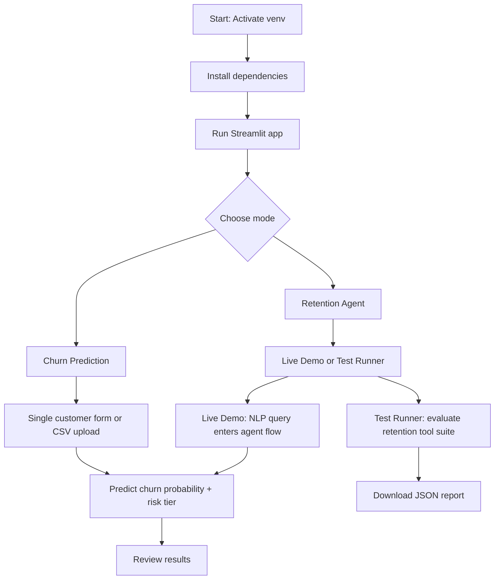

# Customer Churn Prediction System
#### [Click Here for Streamlit Demo](https://tele-connect-k8niczf282r9ojokje49up.streamlit.app/)

This project builds a machine learning pipeline to predict customer churn using customer demographics, subscription information, usage behavior, support history, and satisfaction metrics.

The solution includes:

- Data Quality Assessment
- Data Cleaning
- Exploratory Data Analysis (EDA)
- Feature Engineering
- Model Training
- Model Evaluation
- Model Export
- Prediction Function for Agent Integration

---

# Project Structure

```text
churn_project/
│
├── data/
│   └── test_datafile.csv
│
├── models/
│   └── churn_model.joblib
│
├── outputs/
│   ├── confusion_matrix.png
│   ├── roc_curve.png
│
├── src/
│   ├── data_quality.py
│   ├── feature_engineering.py
│   ├── train.py
│   ├── predict.py
│
├── index.py
│
├── requirements.txt
│
└── README.md
```

---

# Dataset Schema

Expected CSV columns:

| Column |
|----------|
| customer_id |
| age |
| gender |
| tenure_months |
| contract_type |
| monthly_charges |
| total_charges |
| internet_service |
| phone_service |
| avg_monthly_gb_used |
| num_support_tickets |
| avg_monthly_minutes |
| satisfaction_score |
| payment_method |
| num_additional_services |
| last_interaction_date |
| churned |

Target Column:

```python
churned
```

Values:

```text
0 = Active Customer
1 = Churned Customer
```

---

# Step 1: Create Virtual Environment

Windows:

```bash
python -m venv venv
```

Activate:

```bash
venv\Scripts\activate
```

Linux / Mac:

```bash
python3 -m venv venv
source venv/bin/activate
```

---

# Step 2: Install Dependencies

Install all required packages.

```bash
pip install -r requirements.txt
```

Verify installation:

```bash
pip list
```

---

# Step 3: Place Dataset

Copy dataset into:

```text
data/test_datafile.csv
```

Example:

```text
churn_project/
│
├── data/
│   └── test_datafile.csv
```

---

# Step 4: Train Model

Move into src folder:

```bash
cd src
```

Run training:

```bash
python train.py
```

Expected Output:

```text
LogisticRegression ROC-AUC: 0.81

XGBoost ROC-AUC: 0.89

Best model saved.
```

Generated files:

```text
models/churn_model.joblib
```

Additional outputs after training:

```text
data/cleaned_test_datafile.csv
outputs/data_quality_issues.csv
outputs/before_after_statistics.csv
```

---

# Step 5: Verify Model Exists

Check:

```text
models/
│
└── churn_model.joblib
```

If file exists training completed successfully.

---

# Step 6: Return to Project Root

```bash
cd ..
```

Current structure:

```text
churn_project/
│
├── src/
├── models/
├── data/
├── index.py
```

---

# Step 7: Test Prediction

Open:

```text
index.py
```

Example:

```python
from src.predict import predict_churn

customer = {
    "age": 28,
    "gender": "male",
    "tenure_months": 2,
    "contract_type": "month-to-month",
    "monthly_charges": 120,
    "total_charges": 240,
    "internet_service": "fiber",
    "phone_service": "yes",
    "avg_monthly_gb_used": 450,
    "num_support_tickets": 8,
    "avg_monthly_minutes": 150,
    "satisfaction_score": 2,
    "payment_method": "electronic check",
    "num_additional_services": 1,
    "last_interaction_date": "2026-05-15"
}

result = predict_churn(customer)
print(result)
```

Run:

```bash
python index.py
```

Expected Output:

```python
{
    'churn_probability': 0.84,
    'risk_tier': 'high',
    'top_risk_factors': [
        'support_ticket_rate',
        'satisfaction_score',
        'contract_type'
    ]
}
```

---

# Step 8: Run the Combined Streamlit App

The unified Streamlit app supports both churn prediction and the retention agent in one interface.

From the project root:

```bash
streamlit run streamlit_combined_app.py
```

Then open the displayed local URL in your browser.

## Combined App Flow

1. Choose **Churn Prediction** or **Retention Agent** in the sidebar.
2. In **Churn Prediction**:
   - Enter a single customer record or upload a CSV.
   - Run the prediction to view churn probability, risk tier, and top risk factors.
3. In **Retention Agent**:
   - Use **Live Demo** to send natural language requests like `Check on CUST001`.
   - The agent will lookup the customer, predict churn, recommend offers, and log the interaction.
   - Use **Test Runner** to execute the full evaluation suite and download a JSON report.
   - Use **Evaluation Results** to review the agent’s current coverage and roadmap.

## Unified App Mermaid Flow




# Step 9: Run Retention Agent Regression Tests

This project includes a regression test suite for the retention agent logic.

From the repository root, run:

```bash
python3 -m pytest tests/test_retention_agent.py -q
```

Expected output:

```text
2 passed
```

If `pytest` is not installed, install it with:

```bash
pip install pytest
```

---

# Data Cleaning Performed

The system automatically detects:

### Missing Values

Examples:

```text
NULL
NaN
Blank Strings
```

---

### Sentinel Values

Examples:

```text
NA
N/A
UNKNOWN
999
9999
-1
?
```

Converted to:

```python
np.nan
```

---

### Invalid Ages

Examples:

```text
age < 18
age > 100
```

Converted to:

```python
NaN
```

---

### Negative Charges

Examples:

```text
monthly_charges < 0
total_charges < 0
```

Converted to:

```python
NaN
```

---

### Text Standardization

Examples:

```text
Male
MALE
male
```

Converted to:

```text
male
```


---

# Feature Engineering

The following features are created automatically.

### Customer Lifetime Value

```python
monthly_charges * tenure_months
```

---

### Support Ticket Rate

```python
num_support_tickets /
(tenure_months + 1)
```

---

### Usage Intensity

```python
(
 avg_monthly_gb_used +
 avg_monthly_minutes
)
/
(tenure_months + 1)
```

---

### Charge Per Month

```python
total_charges /
(tenure_months + 1)
```

---

### Days Since Last Interaction

Derived from:

```python
last_interaction_date
```

Example:

```text
Customer interacted 45 days ago
```

Stored as:

```python
days_since_last_interaction
```

---

# Models Trained

Two model families are trained.

### Logistic Regression

Advantages:

- Fast
- Explainable
- Strong baseline

---

### XGBoost

Advantages:

- Handles nonlinear relationships
- Handles interactions automatically
- Strong tabular performance

Best model selected automatically using:

```python
ROC-AUC
```

---

# Evaluation Metrics

Training reports:

### Accuracy

```python
accuracy_score
```

### Precision

```python
precision_score
```

### Recall

```python
recall_score
```

### F1 Score

```python
f1_score
```

### ROC-AUC

```python
roc_auc_score
```

---

# Prediction Function

Available in:

```python
src/predict.py
```

Signature:

```python
def predict_churn(customer_data: dict) -> dict:
```

Example Response:

```python
{
    "churn_probability": 0.84,
    "risk_tier": "high",
    "top_risk_factors": [
        "support_ticket_rate",
        "satisfaction_score",
        "contract_type"
    ]
}
```

---

# Streamlit Web App

An interactive web application for real-time churn predictions.

## Overview

The Streamlit app (`streamlit_app.py`) provides a user-friendly interface to:

- **Single Customer Prediction**: Enter customer details via form to get instant churn predictions
- **Batch CSV Upload**: Upload multiple customer records and get predictions for all rows
- **API Integration**: Optional API endpoint configuration for distributed predictions
- **Risk Analysis**: View churn probability, risk tier, and top risk factors

## Running the App

### Prerequisites

1. Train the model first (see Step 4 above)
2. Install Streamlit: `pip install streamlit` (included in requirements.txt)
3. Navigate to project root

### Start the App

```bash
streamlit run streamlit_app.py
```

Expected output:

```text
You can now view your Streamlit app in your browser.

Local URL: http://localhost:8501
Network URL: http://192.168.x.x:8501
```

Open the local URL in your web browser.

### Close the App

Press `Ctrl+C` in the terminal.

## Features

### 1. Single Customer Prediction

**Form Fields:**

- **Demographics**: Age, Gender
- **Subscription**: Tenure (months), Contract type
- **Billing**: Monthly charges, Total charges
- **Services**: Internet service, Phone service, Additional services
- **Usage**: Monthly GB used, Monthly minutes
- **Support**: Number of support tickets
- **Satisfaction**: Satisfaction score (0-5 slider)
- **Payment**: Payment method
- **Interaction**: Last interaction date
- **ID**: Customer ID (optional)

**Workflow:**

1. Fill in all fields (defaults are provided)
2. Click **"Predict"** button
3. View results:
   - Churn probability (0-1)
   - Risk tier (low/medium/high)
   - Top risk factors

### 2. Batch CSV Upload

**CSV Format:**

Upload a CSV file with columns matching the form fields:

```csv
age,gender,tenure_months,contract_type,monthly_charges,total_charges,...
28,male,2,month-to-month,120,240,...
45,female,24,two year,85,2040,...
```

**Workflow:**

1. Click **"Upload CSV with customer rows"**
2. Select your CSV file
3. Review data preview (first 5 rows)
4. Click **"Run batch predictions"**
5. Download results table (all predictions with churn probabilities)

### 3. API Integration (Optional)

**Configuration:**

Sidebar options:
- **Checkbox**: "Use API endpoint"
- **Text input**: "API URL" (default: `http://localhost:8000/predict`)

**When to Use:**

- Predictions run on remote server/microservice
- Distribute load across multiple machines
- Use pre-trained model on different infrastructure

**Fallback Behavior:**

If API fails, automatically falls back to local model prediction.

## App Sections

### Header
- Title: "Churn Prediction Explorer"
- Instructions for both single and batch prediction

### Left Sidebar
- API endpoint configuration
- Optional API URL override

### Main Content
1. Single customer prediction form
2. Single prediction results
3. Batch CSV upload section
4. Batch prediction results

### Footer
- Instructions for running the app
- Quick reference command

## Example Workflow

### Single Prediction

1. Open app at `http://localhost:8501`
2. Enter customer details:
   - Age: 35
   - Gender: Female
   - Tenure: 12 months
   - Contract: One year
   - Satisfaction: 4/5
3. Click **"Predict"**
4. See result: "Churn probability: 0.23, Risk tier: low"

### Batch Prediction

1. Prepare `customers.csv` with 100 customer records
2. Upload file in "Batch predict from CSV" section
3. Review preview of data
4. Click **"Run batch predictions"**
5. See results table with predictions for all customers

## Output Format

### Single Prediction Output

```python
{
    "churn_probability": 0.84,  # 0-1 scale
    "risk_tier": "high",         # low/medium/high
    "top_risk_factors": [
        "support_ticket_rate",
        "satisfaction_score",
        "contract_type"
    ]
}
```

### Batch Prediction Output

DataFrame with columns:
- `churn_probability`: Probability value for each customer
- `risk_tier`: Risk classification (low/medium/high)
- `top_risk_factors`: List of factors for each row

## Troubleshooting

### App Won't Start

**Error**: Port 8501 already in use

**Solution**:

```bash
streamlit run streamlit_app.py --server.port 8502
```

### Model Not Found Error

**Solution**: Ensure model exists at `models/churn_model.joblib` by running training first.

### API Request Failed

**Fallback**: App automatically uses local model. Check API URL configuration.

### CSV Upload Issues

**Check**:
- File format is CSV (not Excel)
- Column names match expected fields
- No special characters in headers
- File size is reasonable (<50MB)

---

# Common Errors

### ModuleNotFoundError

Run from project root:

```bash
python index.py
```

NOT:

```bash
python src/index.py
```

---

### Dataset Not Found

Ensure:

```text
data/test_datafile.csv
```

exists.

---

### Model Not Found

Train first:

```bash
cd src

python train.py
```

---

# Re-Training

If dataset changes:

Delete:

```text
models/churn_model.joblib
```

Then:

```bash
cd src

python train.py
```

New model will be generated automatically.

---

# Future Improvements

- SHAP Explainability
- Hyperparameter Tuning
- Cross Validation
- Precision-Recall Optimization
- FastAPI Deployment
- Docker Support
- MLflow Tracking
- LangGraph Agent Integration
